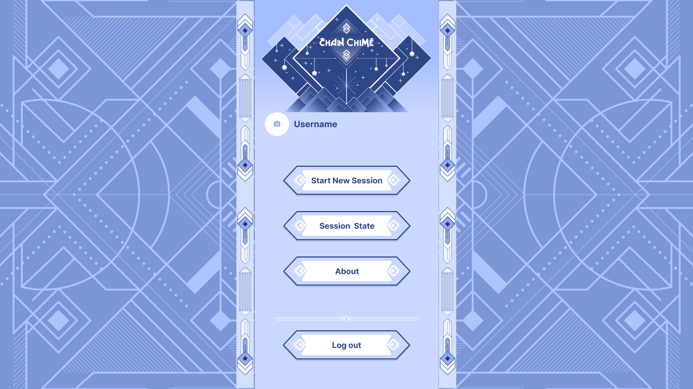

<p align="center">
  
</p>

# ChainChime

ChainChime is a web application crafted for individuals facing executive dysfunction, designed to streamline task management seamlessly.  
Developed with **React** and **JavaScript**, it utilizes the robust capabilities of **Google Firebase** for secure, real-time data handling, ensuring a responsive and fluid experience across devices.  

The application is structured to facilitate task organization through advanced data structures like arrays, hash tables, and trees, offering a perfect blend of structured productivity and adaptability.  

Prioritizing security, ChainChime enhances user privacy by implementing **hashing for task labels**, augmenting Firebase’s inherent password hashing. This added measure ensures that task specifics are kept confidential, safeguarding user information even from those with database access. Optimized for performance, the backend efficiently manages complex datasets, ensuring swift and seamless functionality.  

A key feature of ChainChime is its integration of a **Pomodoro-inspired timer** alongside multi-level to-do lists, empowering users to dissect large tasks into smaller, manageable units. This approach not only mitigates overwhelm from hefty assignments but also promotes sustained concentration through customizable work-rest intervals.  

## Website
https://chainchime.web.app

## Screenshots
<p align="center"></p>
<p align="center"></p>
<p align="center"></p>
<p align="center"></p>
<p align="center"></p>
<p align="center"></p>
<p align="center"></p>
<p align="center"></p>

## Features
- Multi-level to-do lists using arrays, hash tables, and trees.
- Pomodoro-style timer integrated with tasks for focused intervals.
- Task labels are **hashed on the client** before storage for ultimate privacy.
- Real-time data sync across devices with Firebase.
- Cross-device persistence: tasks, timers, and preferences sync with your account.
- Fully responsive design, optimized for desktop and mobile browsers.

## Tech Stack
- **Frontend:** React, JavaScript, HTML, CSS  
- **Backend:** Firebase Authentication, Cloud Firestore, Cloud Functions (optional)  
- **Design:** Figma  
- **Build/Tooling:** Vite or Create React App, ESLint, Prettier  
- **Deployment:** Firebase Hosting  

## Requirements
- Node.js LTS and npm  
- A Firebase project with Authentication and Firestore enabled  

## Installation
```bash
# Clone
git clone https://github.com/liscontoli/ChainChime.git
cd ChainChime

# Install dependencies
npm install
